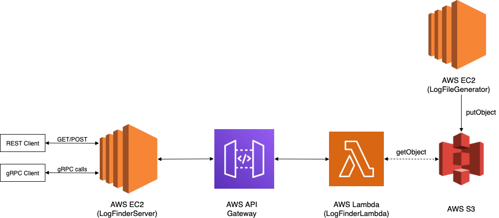

# Overview
The following scheme represents an high-level overview of the implemented architecture.



## Components
### LogFileGenerator
The `LogFileGenerator` has been modified in order to upload log files to AWS S3. In particular the logs are written to a file in the `log` folder, and when the current *batch* of logs has been generated, the content of this file is added to the log file contained in S3, using the credentials and bucket details specified with the following configuration in the `application.conf` file:

```
awsAccessKey = ...
awsSecretKey = ...
s3BucketName = ...
s3ObjectKey = "log"
```

In order to continuously add new logs to S3, it's possible to create a simple shell script that periodically launch the JAR of the `LogFileGenerator`.

#### Deployment
This module has been deployed to AWS EC2, on a `t2.micro` instance. Once the EC2 instance has been launched from the AWS console, the procedure needed to deploy the application is the following:

1) Transfer the executable JAR file to the remote instance (the .pem certificated generated on the instance creation is needed for SSH/SCP authentication):
```
chmod 400 LogFileGeneratorEC2.pem
scp -i ./LogFileGeneratorEC2.pem ./LogFileGenerator.jar ec2-user@<EC2_INSTANCE_ENDPOINT>:~
```

2) Then we need to access the remote instance via SSH or by using the EC2 Instance Connect feature from the console, and execute the JAR:
```
java -jar LogFileGenerator.jar
```

### LogFinderLambda
This is the component that implements the Lambda Function and performs the search on the log file. Once the log file has been retrieved from S3, a binary search is performed to search for logs in the time intervals passed as input by the Client.
At the end, all the found log files are filtered, in order to return only the logs that have an associated String instance that matches the Regex pattern specified in the configuration.

The response given to the Client contains either the message *not found* (with status code 404) or a JSON output containing the MD5 hash of the concatenation of all the String instances associated with the found logs (and status code 200).

AWS API Gateway is in charge of forwarding requests and response between the entity that has performed the request the Lambda Function. In practice, it works as a proxy for the other components that are requesting a log search to the deployed FaaS application. 

#### Example request/response

Request:

```
curl -X GET 'http://localhost:3000/logfinder?time=18:34:32&dtInSeconds=1'
```

- `time` represents the *middle time* of the time interval we are searching in the log file
- `dtInSeconds` represents the delta time needed to compute the exact time interval to be searched

For the example request shown above, the time interval considered will be from `18:33:32` to `18:35:32`.

Response:

```
{
    result_md5: "dadff85a41c47446bb796327f7ee2f84"
}
```

When no logs are found, the response will be the following:

```
{
    error: "not found"
}
```

As we can see, instead of responding true or false to signal the presence or the absence of the searched logs, it is possible to use the responses shown above: if the JSON response contains the key `result_md5` then this actually signals the presence of the searched log, otherwise it wasn't found.

#### Deployment
In order to deploy the Lambda Function to AWS Lambda, it's possible to make use of the AWS SAM CLI, as described in the readme.

The procedure is the following:
1) Configure AWS credentials with the AWS CLI:
    ```
    aws configure
    ```
   The AWS access key, secret key and the region will be asked for the configuration.
2) Create the `packaged.yaml` file:
    ```
    sam package --s3-bucket <S3_BUCKET_NAME> --output-template-file packaged.yaml
    ```
3) Deploy the Lambda Function to AWS:
    ```
    sam deploy --template-file packaged.yaml --stack-name aws-lambda-log-finder --capabilities CAPABILITY_IAM
    ```

### LogFinderServer
The Server component implements the actual endpoints that will be called by the Client to search in the logs, both using gRPC and REST architectural style.

#### gRPC
The gRPC communication has been implemented by making use of the `Akka gRPC` library. The communication protocol consists of two simple messages: `FindLogRequest` and `FindLogReply`, defined by the following protobuf:

```
// Log Finder Service definition
service LogFinderService {
  // Finds a log in the AWS S3 log files
  rpc FindLog (FindLogRequest) returns (FindLogReply) {}
}

// The request message containing details about the searched time interval (the time and the delta to compute the time intervals)
message FindLogRequest {
  string time = 1;
  string dtInSeconds = 2;
}

// The response message containing the JSON response to the Client (contains the MD5 hash of the regex instances in found logs)
message FindLogReply {
  string message = 1;
}
```

Once a `FindLogRequest` has been received, the gRPC server will perform the request to the API Gateway in order to invoke the Lambda Function.

##### Example of interaction

gRPC server side:

```
[info] running grpc.GRPCServer 
[2021-11-05 11:19:23,469] [INFO] [akka.event.slf4j.Slf4jLogger] [LogFinderServer-akka.actor.default-dispatcher-3] [] - Slf4jLogger started
[2021-11-05 11:19:24,319] [INFO] [grpc.GRPCServer$] [LogFinderServer-akka.actor.default-dispatcher-3] [] - gRPC server bound to 0:0:0:0:0:0:0:0:8081
[2021-11-05 11:23:30,147] [INFO] [grpc.GRPCServer$] [LogFinderServer-akka.actor.default-dispatcher-9] [] - findLog invoked...
[2021-11-05 11:23:30,148] [INFO] [grpc.GRPCServer$] [LogFinderServer-akka.actor.default-dispatcher-9] [] - Calling API Gateway endpoint...
```

gRPC client side:

```
[2021-11-05 11:23:29,535] [INFO] [akka.event.slf4j.Slf4jLogger] [LogFinderClient-akka.actor.default-dispatcher-3] [] - Slf4jLogger started
[2021-11-05 11:23:29,864] [INFO] [grpc.LogFinderClient$] [run-main-0] [] - Performing request, input: time = 18:34:32, dt = 10
[2021-11-05 11:23:31,348] [INFO] [grpc.LogFinderClient$] [LogFinderClient-akka.actor.default-dispatcher-3] [] - Received reply: FindLogReply({"result_md5": "af67e8751cf8eb878c39976f39bf36b8"},UnknownFieldSet(Map()))
```

#### Deployment
This module has been deployed to AWS EC2, on a `t2.micro` instance. Both the gRPC Server and the REST Server are packaged in the same module (`LogFinderServer`), so we will need to execute the same JAR two times (with different main classes) in order to launch both services.

Once the EC2 instance has been launched from the AWS console, the procedure needed to deploy the application is the following:

1) Transfer the executable JAR file to the remote instance (the .pem certificated generated on the instance creation is needed for SSH/SCP authentication):
```
chmod 400 Server.pem
scp -i ./Server.pem ./Server.jar ec2-user@<EC2_INSTANCE_ENDPOINT>:~
```

2) Then we need to access the remote instance via SSH or by using the EC2 Instance Connect feature from the console. We can use the `screen` tool already installed on the OS (Amazon Linux 2) in order to leave both the Servers running also when we detach from the SSH session:

To launch the REST Server:
```
screen
java -cp Server.jar rest.RESTServer
```

To launch the gRPC Server:
```
screen
java -cp Server.jar grpc.GRPCServer
```

In order for our deployed services to be accessible from outside, we will need to configure the security policy in order to allow inbound connections on ports 8080 (REST) and 8081 (gRPC).

#### REST
The REST architectural style backend has been implemented by making use of the `Akka HTTP` library. Both `GET` and `POST` endpoints are implemented to perform the search.

##### Example requests

For all the requests, the response are omitted since they are the same as those shown for `LogFinderLambda` (they are simply forwarded from the Lambda Function to the Client)

###### GET method
Request:
```
curl -X GET 'http://localhost:8080/api/findlogs?time=18:34:32&dtInSeconds=10'
```

###### POST method
Request:
```
curl -X POST http://localhost:8080/api/findlogs -H "Content-Type: application/x-www-form-urlencoded" -d "time=18:34:32&dtInSeconds=10"
```

### LogFinderClient
Regarding the implemented clients, they are simple Scala applications useful to show how to perform calls to the implemented gRPC/REST endpoints.

For the REST Client, the `scalaj-http` and Apache `httpclient` have been used to make requests, while the gRPC we made use again of the `Akka gRPC` library to send RPCs to the backend.


